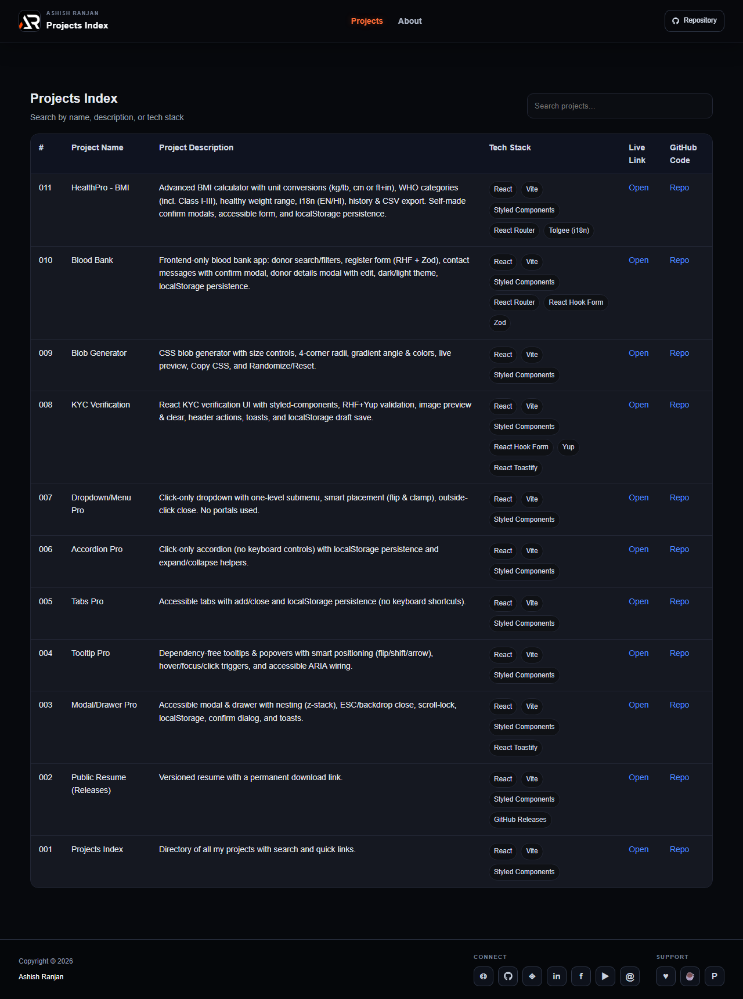

# Projects Index

A searchable React directory of Ashish Ranjan's frontend projects with live demos, source repositories, and technology tags.



## Features

- Search projects by name, description, or technology.
- Quick links to live demos and GitHub repositories.
- Lazy-loaded home, about, and not-found routes.
- Fixed responsive header with local logo and mobile menu.
- Icon-only social and support links in the footer.
- Floating scroll-to-top control.
- GitHub Pages ready with a Vite base path.

## Tech stack

React, Vite, React Router, Material UI, styled-components, and React Icons.

## Run locally

```bash
npm install
npm run dev
```

Validate, build, and deploy:

```bash
npm run lint
npm run build
npm run deploy
```

Live URL: [a2rp.github.io/projects](https://a2rp.github.io/projects/)

## Links

- [Portfolio](https://www.ashishranjan.net/)
- [GitHub](https://github.com/a2rp)
- [CodePen](https://codepen.io/ash1198)
- [LinkedIn](https://www.linkedin.com/in/aashishranjan)
- [Facebook](https://www.facebook.com/theash.ashish/)
- [YouTube](https://www.youtube.com/@ashishranjan-ashz?sub_confirmation=1)

## Support

- [Support](https://a2rp-donation-page.netlify.app/)
- [Buy Me a Coffee](https://buymeacoffee.com/a2rp)
- [Patreon](https://patreon.com/a2rp)

## License

MIT License. See [LICENSE](LICENSE).
